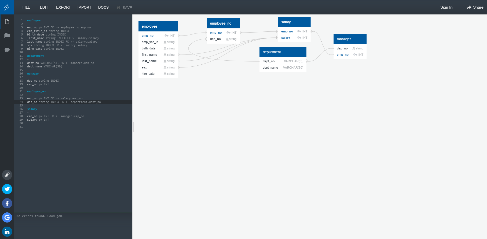

# SQL Practice

## Objective 

I needed to make a compilation of employee records in a short and simple way.

## What I did

I made a mockup list of the employees and their information. It would show their pay and other information in an organized fashion. This was done by creating a table that would house most of the information about the employees and created branches that would suit the need for certain needs on some of the employees.

All SQL files have been organized and properly stored away for future refernce. Everything is neat and tidy for other coworkers to understand if in the event they are needed to edit the document.

## Example

